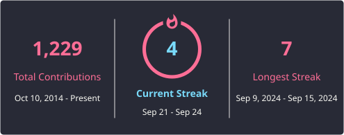

<h1 align="center">Hi, I'm Gustavo Campagnin 👋</h1>

<p align="center">
  <strong>Full Stack Developer · Backend APIs · React · AI Integrations</strong>
</p>

<p align="center">
  Building scalable applications, clean architectures, and intelligent solutions.
</p>

<p align="center">
  
</p>

---

### 👨‍💻 About Me

```typescript
const gustavo = {
  location: "Brazil 🇧🇷",
  role: "Full Stack Developer",
  focus: [
    "Backend APIs",
    "Scalable Architectures",
    "React Applications",
    "AI Integrations"
  ],
  principles: ["Clean Code", "Maintainability", "Scalability"],
  learning: "Always something new 📚",
  funFact: "I turn coffee into code ☕ → 💻"
};
```

I am a software developer focused on building **reliable, scalable, and maintainable applications**.

My work spans the full stack, with a strong interest in **backend engineering, API design, software architecture, React applications, and AI-powered solutions**.

I enjoy transforming complex requirements into simple solutions and believe good software should be as well-designed internally as it is useful externally.

---

### 🧰 Tech Stack

<p align="left">
  
</p>

#### Backend & Architecture

<p>
  
  
  
  
</p>

#### AI & Automation

<p>
  
  
  
</p>

---

### 📊 GitHub Stats

<div align="center">
  
  
</div>

<br />

<div align="center">
  
</div>

---

### 🎯 What I Care About

- Designing APIs with clear contracts and maintainable boundaries
- Building software that scales without unnecessary complexity
- Applying clean architecture principles pragmatically
- Improving developer experience through automation and tooling
- Exploring practical ways to integrate AI into real products

---

### 🤝 Let's Connect

<p align="left">
  <a href="mailto:gcampagnin@gmail.com">
    
  </a>
  <a href="https://github.com/gcampagnin">
    
  </a>
</p>
